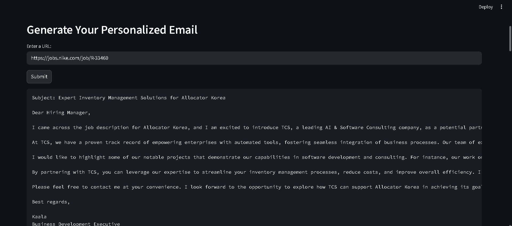

# AI-Powered Cold Email Generator

This project is an **AI-driven Cold Email Generator** built using **LLaMA** and Streamlit. It automatically creates personalized outreach emails based on user input, helping streamline communication for sales, networking, recruiting, and other professional purposes.

---

## Features

- Generate **personalized cold emails** in seconds.
- Built on **LLaMA**, showcasing large language model capabilities.
- Streamlined workflow using **Streamlit** for an interactive UI.
- Supports **multiple use cases**: sales, recruitment, collaborations.
- Fully customizable input prompts and templates.
- Avoids sensitive data leaks using `.gitignore` and proper secret handling.

---

## Installation

### 1. Clone the repository:
```bash
git clone https://github.com/Kaala741/AI-cold-email-generator.git
cd AI-cold-email-generator
```


### 2.Create and Activate a Virtual Environment

```bash
python -m venv .venv
# Windows
.venv\Scripts\activate
# macOS/Linux
source .venv/bin/activate
```

### 3.Install dependencies:

```bash
pip install -r requirements.txt
```

## Usage

### Run the Streamlit app:
```bash
streamlit run app/main.py
```

Open the URL shown in the console (usually http://localhost:8501).

Enter your details in the input form and generate your personalized cold email.

---
## **Demo**
Check out the live demo of the app: 

## **Screenshot 1**:


## **Screenshot 2**:




---

## Folder Structure

```bash
cold_email_generator/
│
├─ app/                     # Main app and backend logic
│  ├─ main.py               # Streamlit app
│  ├─ chains.py             # Email generation logic
│  ├─ portfolio.py
│  ├─ utils.py
|  ├─ .env
|  ├─ anime.jsom
│  └─ resource/             # Example CSV or data files
|  
├─ vectorstore/             # LLaMA embedding storage
│
├─ chromadb_setup.ipynb     # Optional setup notebook
├─ cold_email_generator.ipynb  # (Removed from repo history due to secrets)
├─ .gitignore
├─ requirements.txt
└─ README.md
```
---

## Security & Best Practices

-**Secrets**: API keys and sensitive files should never be committed. Use .env files or Streamlit secrets.

-**Git**: Already cleaned sensitive files from repo history.

-**Dependencies**: Keep requirements.txt updated to avoid vulnerabilities.

---

## Contributing

Contributions are welcome! Please follow these guidelines:

1. **Fork the repository**.

2. **Create a new branch**:
```bash
git checkout -b feature-name
```
3. **Make your changes and commit:**
   ```bash
   git commit -m "Description of your changes"
   ```
4. **Push to your branch**:
```bash
git push origin feature-name
```
---

## License

MIT License – see LICENSE file for details.

